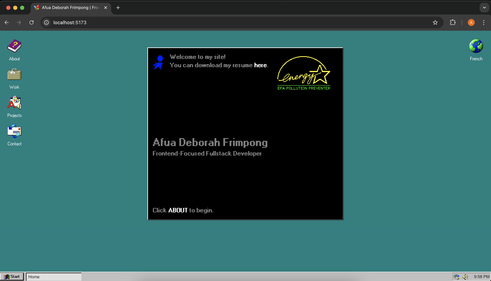

# Afua Deborah Frimpong: Frontend-Focused Fullstack Developer

A Windows 98-inspired portfolio of a frontend-focused fullstack developer. This site is a monorepo/multipackage setup with a React + Vite powered frontend, and a Node backend.

My previous portfolio site is still alive and well and can be found [here](https://afuadeborah.github.io/portfolio), but after 5 years in the industry it didn't feel like **me** anymore.

Inspired by another project I was working on with a similar design and layout, I opted to start a rebuild with a Windows 98 nostalgia flair, and demonstrate how far I've come in understanding and applying concepts such as:

-   Project folder + component structure
-   My fancy fullstack stack: React, TypeScript, Node
-   State, loading, and error management
-   API and Data Management
-   Design sensibilities and UX

This is currently a WIP, so this README is a living, breathing document.

Thanks for stopping by, you'll be first to know once I have this site up and running!

## Screenshots

## Stack

**Frontend**

-   React
    -   SCSS
    -   Bootstrap
    -   [98.css](https://github.com/jdan/98.css) for the Windows 98 theme created by [Jordan Scales](https://jordanscales.com/)
-   TypeScript

**Backend**

-   Node.js
-   Express.js
